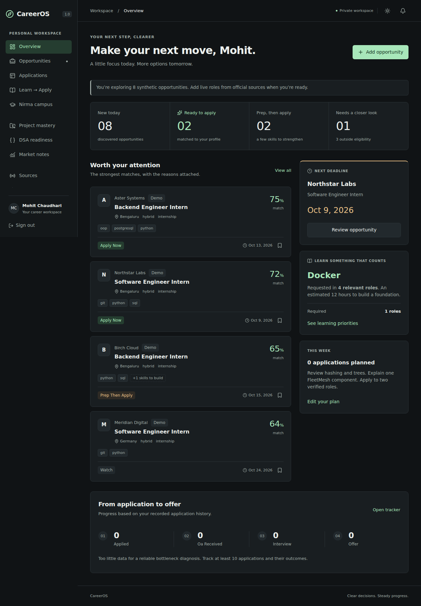
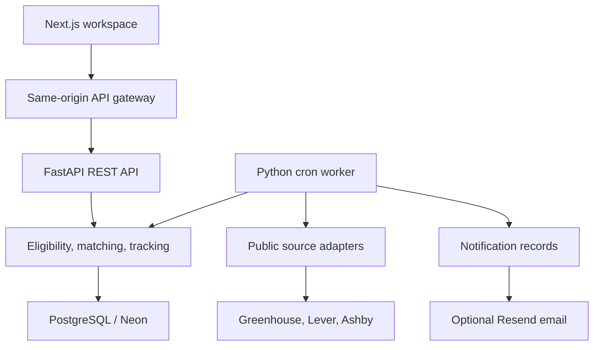

# CareerOS

Personalized Internship, Job, Learning & Career Intelligence System.

CareerOS is a private workspace for deciding what to apply to, checking hard eligibility requirements, seeing why an opportunity fits, tracking the hiring funnel, and learning skills that appear in relevant jobs. It starts with Mohit's Nirma/2028 profile through an **explicit, editable demo seed**. New accounts begin empty.

## Implemented in V1

- Email/password login, Argon2id hashing, 15-minute opaque access tokens, rotating 7-day sessions, HttpOnly cookies, CSRF checks, persistent rate limits and user ownership checks.
- Editable education, preferences, skills/evidence, project mastery, external links and resume metadata; password changes with session revocation and an operator account-management CLI.
- Public Greenhouse, Lever and Ashby adapters, operator-approved official JSON feeds, manual entry and campus notice parsing/review.
- Canonical deduplication with source occurrences and raw payloads, editable source configuration, opt-in missing-posting reconciliation, source health, independent record failure handling and retry/backoff.
- Five-state deterministic eligibility, explainable eight-factor matching and market-weighted skill-gap recommendations.
- Search/filtering, save/apply tracking, append-only event history, deadlines, OA/interview dates and conservative funnel analytics.
- In-app high-match alerts, deadline reminders, daily digests and weekly summaries; optional Resend delivery.
- DSA practice logging, editable learning progress, sourced monthly market notes and international-rule notes with stale warnings.
- Responsive dark/light UI, keyboard-accessible forms/dialogs, loading/empty/error states.
- Nine worker commands including automatic `discover-jobs` and a resilient `run-cycle`, Alembic migrations, Docker configuration, GitHub Actions and Render Blueprint.

**Read [VERIFICATION.md](docs/VERIFICATION.md) for exactly what was run and the limits of that evidence.** This repository is configured for deployment; it has not been deployed to a cloud account.

## Screenshots



See [mobile](docs/screenshots/dashboard-mobile.png) and [light theme](docs/screenshots/dashboard-light.png). All displayed seed vacancies are fictional.

## Architecture



The UI never calculates eligibility itself. Domain functions are shared by API and workers. SQLAlchemy uses synchronous sessions in synchronous FastAPI endpoints; external feed requests use asynchronous HTTP. This is deliberately one backend and one worker package, not microservices.

## Stack

Next.js 16.3.8, React, TypeScript, Tailwind CSS, TanStack Query and Zod; Python 3.12+, FastAPI, Pydantic v2, SQLAlchemy 2, Alembic and PostgreSQL. SQLite is a local-development fallback only. Exact dependencies are captured in `requirements.lock`, `requirements-dev.lock` and `apps/web/package-lock.json`.

## Local setup

Requirements: Python 3.12+, Node.js 24.15.0 or newer in the 24.x series, npm; Docker for the preferred PostgreSQL path. Commands below run from the repository root. For native Windows PowerShell, follow [WINDOWS_SETUP.md](docs/WINDOWS_SETUP.md), including recovery after interrupted downloads. On macOS/Linux, use the commands below.

```bash
cp .env.example .env
cp apps/web/.env.example apps/web/.env.local
# Edit .env if necessary, then:
docker compose up -d db
python3 -m venv .venv
.venv/bin/pip install -r requirements-dev.lock
.venv/bin/pip install --no-deps -e .
cd apps/web
npm ci
cd ../..
.venv/bin/alembic upgrade head
```

Without Docker, change root `.env` to `DATABASE_URL=sqlite:///./careeros.db` before migrating. Never use SQLite for multi-instance production deployments.

Create an empty personal account without enabling public registration (password entered securely at the prompt):

```bash
.venv/bin/python -m careeros.manage create-user --email your@email.example --name 'Your name'
```

For operator-assisted recovery, use `python -m careeros.manage reset-password --email your@email.example`; it revokes existing sessions and records an audit event. Signed-in users can change their password in **My profile**.

To seed the demo instead, choose your own password. The command does not overwrite an existing account.

```bash
export DEMO_PASSWORD='replace-with-your-own-long-password'
.venv/bin/python -m careeros.seed --email mohit@example.com
```

Alternatively, put `DEMO_PASSWORD` in `.env` and export it before the seed command. It is intentionally not read from `.env` by the seed CLI; shell environment avoids accidentally seeding a production account with a saved local password.

Start two terminals:

```bash
# Terminal 1, repository root
.venv/bin/uvicorn careeros.main:app --reload --host 127.0.0.1 --port 8000
# Terminal 2
cd apps/web
npm run dev
```

Open **http://localhost:3000**. Use the exact origin `localhost`, not `127.0.0.1`, for the browser unless you change both `FRONTEND_ORIGIN` settings. Log in with the email/password you seeded, or register a blank account.

API docs: **http://localhost:8000/docs**. Exported OpenAPI: [packages/shared/openapi.json](packages/shared/openapi.json). The browser uses `/api/*` on port 3000; the gateway forwards to FastAPI and relays host-only cookies, avoiding third-party-cookie problems between Vercel and Render.

Convenience commands: `make install`, `make migrate`, `make seed`, `make api`, `make web`, `make verify`.

## Automatic internship discovery

Automatic discovery is on by default while the backend runs. Existing and new accounts receive six starter public employer boards automatically; no API key or manual board entry is required. A first check starts within about 30 seconds and subsequent checks run every six hours. Failed/partial checks retry after one hour. Due checks resume after a restart.

The starter feeds keep technical internships and explicitly junior/graduate/entry-level roles; manual sources retain their existing behavior. Jobs are deduplicated and ranked against your profile. Imported academic/deadline requirements still need review. Dashboard and Sources show last/next checks, new jobs, coverage and failures. Sources also has **Check now**, **Pause discovery** and **Resume discovery**.

In-app high-match/deadline alerts and daily/weekly summaries are generated by the automatic cycle. Email remains optional. This covers the included company boards and added sources, not all websites or private campus portals. Your computer must be awake and online for fetching; the browser may be closed, but the backend process must stay running. See [AUTOMATIC_DISCOVERY.md](docs/AUTOMATIC_DISCOVERY.md).

For an existing installation: stop the backend, back up your database, replace the project files while preserving `.env` and data, run `.venv/bin/python -m alembic upgrade head` (Windows: `.\.venv\Scripts\python.exe -m alembic upgrade head`), then restart both servers.

## Your first useful workflow

1. Open **My profile**. Review education, existing work authorizations and self-assessed skills. Seeded project skills are deliberately unverified.
2. Wait for the automatic first check. Open **Sources** to see included boards and source health. You can add additional public company boards; leave country **Unknown** for mixed boards.
3. Or add a job manually. Campus notices have an explicit extraction/review step; dates and requirements must be checked before saving.
4. Open an opportunity to see hard-rule results, missing skills, evidence and score factors. Unknown authorization is a review item, not a visa approval.
5. Save it. In **Applications**, mark Applied and record each later stage, OA/interview date and resume used. This records your actions; it does not submit applications.
6. Check **Learn → Apply**, track practice and update your evidence when you can demonstrate a new skill.
7. Keep the backend running for scheduled discovery and alerts. Pause/resume or request a check from Sources.

## Environment variables

| Variable | Required | Purpose |
|---|---|---|
| `DATABASE_URL` | Production | PostgreSQL connection; use Neon **direct** endpoint with TLS for advisory locks |
| `FRONTEND_ORIGIN` | Both services | Exact browser origin, no trailing slash |
| `COOKIE_SECURE` | Production: `true` | HTTPS-only cookies |
| `ENVIRONMENT` | Production: `production` | Enforces HTTPS/cookie/PostgreSQL startup requirements |
| `REGISTRATION_ENABLED` | Optional | Disable after creating the personal account |
| `API_BASE_URL` | Frontend server | Render backend origin; never `NEXT_PUBLIC_` |
| `ALLOWED_FEED_HOSTS` | Custom feeds only | Comma-separated operator-approved HTTPS hosts |
| `RESEND_API_KEY`, `EMAIL_FROM` | Email only | Verified sender/provider credentials |
| `AI_API_KEY`, `AI_MODEL`, `AI_BASE_URL` | AI only | Optional OpenAI-compatible campus extraction; rules remain the fallback |
| `DEMO_EMAIL`, `DEMO_PASSWORD` | Demo CLI only | Explicit seed credentials; never production defaults |

Without email credentials, alerts remain in-app. Without AI credentials, extraction uses conservative rules. No secret is needed to run matching.

## Workers and scheduling

```bash
.venv/bin/python -m worker ingest-jobs
.venv/bin/python -m worker refresh-jobs
.venv/bin/python -m worker calculate-matches
.venv/bin/python -m worker expire-jobs
.venv/bin/python -m worker send-daily-digest
.venv/bin/python -m worker send-deadline-alerts
.venv/bin/python -m worker weekly-summary
.venv/bin/python -m worker run-cycle
.venv/bin/python -m worker discover-jobs
```

Workers use session advisory locks on PostgreSQL and process locks for local SQLite. Ingestion locks are shared across worker and manual runs per user. Alerts use per-user locks and unique dedupe keys. A failed source is recorded and other sources continue. The CLI exits nonzero for failed/degraded ingestion. `run-cycle` attempts ingestion, matching, expiry and deadline alerts even if an earlier stage fails, then reports aggregate errors. Weekly summaries cover the preceding seven days; digests include upcoming deadlines and recorded actions.

## Testing

```bash
.venv/bin/ruff check apps/api apps/worker
.venv/bin/ruff format --check apps/api apps/worker
.venv/bin/pytest -q
cd apps/web
npm run lint
npm run typecheck
npm run test
npm run build
npx playwright install chromium
# Start real servers against an isolated migrated/seeded database:
cd ../..
scripts/verify-browser.sh
```

Only set `TEST_DATABASE_URL` to a **disposable** database: integration fixtures create and drop all application tables. Native PostgreSQL tests and browser E2E are configured in CI. See [TESTING.md](docs/TESTING.md).

## Deployment

See [DEPLOYMENT.md](docs/DEPLOYMENT.md) for Neon → Render → Vercel setup, credentials, migration order, cron schedules and smoke checks. Applying `render.yaml` can incur hosting/cron charges; no resources are created just by having the file. Full local container setup is also provided: `docker compose --profile app up --build` after configuring `.env`.

## Known limitations and next improvements

- No email verification, self-service password reset, MFA or public signup abuse service. Deploy as a private/personal tool and close registration after onboarding.
- Source-board country is configured, not inferred with certainty. Use Unknown for mixed boards; manual review is required for visa, ambiguous degree and language rules.
- The conservative parser does not understand every notice format. Preferred/required skill inference from prose remains heuristic. Review extraction evidence; use manual entry if needed.
- No resume upload or resume-content analysis; metadata only. No automatic LinkedIn/LeetCode/email/Drive sync and no automatic job applications.
- Source closure is opt-in: choose 2–10 consecutive complete, nonempty, error-free snapshots before marking an occurrence missing. A canonical job closes only after every occurrence is inactive. Empty/failed/partial feeds do not trigger closure. Manual archive survives refresh and can be explicitly restored.
- Ranking and filtering load a user's postings into memory before sorting/pagination. Suitable for hundreds to low thousands, not millions. Persisted match snapshots are available for future database-side search; UI recomputes for correctness after edits.
- Score weights, learning-hour estimates and funnel thresholds are transparent heuristics, not validated hiring predictions.
- Visa notes and market reports are manual, sourced notes. There is no automated legal interpretation or salary intelligence feed.
- Optional AI currently enriches campus parsing only. Match explanations and learning recommendations are deterministic.
- Email delivery is retryable with a provider idempotency key; rare duplicates are possible if a provider succeeds but its response is lost beyond its idempotency retention window.
- Hosted deployment, real email delivery and configured LLM calls require your credentials and separate smoke testing.

Next improvements: verified-account recovery; richer job revision history; broader date/skill extraction coverage; generated TypeScript types from OpenAPI; moving filtered candidate selection into SQL when job volume warrants it.

## Study this code

Start with [LEARNING_GUIDE.md](docs/LEARNING_GUIDE.md), then [ARCHITECTURE.md](docs/ARCHITECTURE.md), [ELIGIBILITY_ENGINE.md](docs/ELIGIBILITY_ENGINE.md), [MATCHING_ENGINE.md](docs/MATCHING_ENGINE.md), [DATABASE.md](docs/DATABASE.md), [JOB_INGESTION.md](docs/JOB_INGESTION.md), and [SECURITY.md](docs/SECURITY.md).
