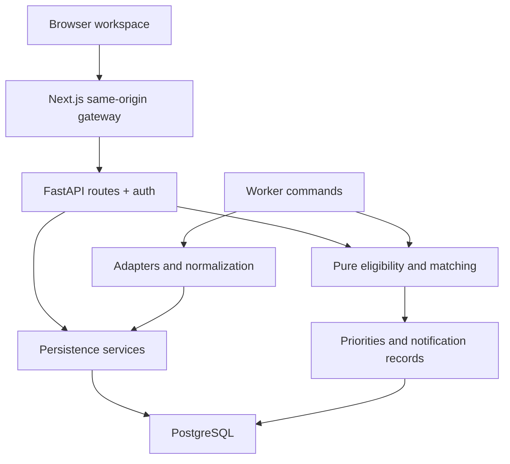

# Architecture

CareerOS has one domain backend, one browser UI and one CLI worker entry point. API routes own HTTP concerns. Domain services implement business rules. Source adapters isolate vendor differences. SQLAlchemy models and Alembic migrations own persistence.

## Boundaries

- `apps/web/app/api/[...path]/route.ts`: forwards approved path segments and selected headers to one server-configured origin. It is not an open proxy.
- `apps/api/careeros/routers`: authenticated resource boundaries, Pydantic input validation, server-side ownership and consistent HTTP errors.
- `services/eligibility.py`: deterministic five-state hard-rule decisions; no network or LLM.
- `services/matching.py`: weights and set intersections; configurable preferences; pure results.
- `services/repository.py`: user context loading, canonical identity, upsert and serialization.
- `services/sources.py`: shared adapter contract and bounded public HTTP access.
- `services/ingestion.py`: transactions/savepoints, failure isolation and source-run evidence.
- `services/notifications.py`: records first; delivery second; email optional.
- `services/outbound.py`: bounded provider POST retries; ambiguous transport/5xx failures retry only with an idempotency key.
- `middleware.py` and `logging_config.py`: bounded request streams and shared API/worker JSON logs.
- `apps/worker/worker/__main__.py`: schedules call the same services instead of duplicating logic.

## Request example

A job-detail request authenticates a hashed access token, checks `job.user_id`, loads the profile and explicitly recorded skill/project evidence, evaluates hard requirements, computes fit, and returns both explanations and raw fields. TanStack Query caches that response briefly and invalidates relevant data after a mutation. Scores shown after profile updates are recomputed from current data, avoiding stale cache decisions.

## Persistence trade-offs

Identity/ownership/join-heavy relationships are relational. Variable source requirements, extraction evidence, preferences and low-volume notes use validated JSON. Project technologies and verified skills are small JSON lists; they are not globally normalized joins in V1. Eligibility is included in `job_matches.data` rather than duplicated in a separate table. Market and visa records include country names; a separate country catalogue is unnecessary until country metadata becomes a maintained dataset.

Synchronous SQLAlchemy keeps transaction lifetimes explicit and easy to debug. FastAPI sync endpoints run in its threadpool; source network requests are async. The ingestion route runs in the threadpool and creates its asynchronous fetch loop there, keeping synchronous database work off the main event loop. Manual ingestion is bounded but can outlast a serverless gateway timeout for unusually large boards. Use the cron worker for large sources. No queue is needed initially; a future queue can call `ingest_source` without changing matching.

## Consistency

A per-user writer lock shared by ingestion and manual job/source mutation protects cross-source deduplication and a unique canonical key guards collisions. Upserts are single-transaction, malformed records roll back to a savepoint, and each source commits its own run. Refresh and status updates use database row locks where supported. Notifications have both unique keys and locking. Application events have append-only database triggers. Shared company/skill inserts use database conflict handling across users. `run-cycle` isolates each scheduled stage and reports aggregate failures. Tests use disposable databases.

## Scaling boundary

Avoid N+1 reads with joined/select-in relationships; the user-facing search still computes all matches in memory. Complexity is approximately O(J × (S + P)) for J jobs, S candidate/job skill inputs and P project evidence, plus O(J log J) sorting. This is a deliberate personal-scale trade-off. At larger volume, filter coarse SQL candidates first, use persisted versioned match results and cursor pagination. Do not add distributed caches before measuring.

## Automatic discovery

The API lifespan starts one bounded background thread when `AUTO_DISCOVERY_ENABLED=true`. It polls persisted per-user schedules every 30 seconds, immediately scans due users, and uses the same domain/import services as `worker discover-jobs`. Per-user advisory/file locks prevent duplicate checks across processes. Successful checks schedule six hours later; failures retry in one hour. Sources are bootstrapped idempotently; existing source settings and disabled sources are preserved. Source fetches finish before a SQLite write transaction begins, keeping slow internet requests from blocking local mutations.

A curated catalog provides public board identities; it does not run a search engine or guess arbitrary URLs. Technical early-career filters apply only to automatically added sources. HTTP limits, provenance, deduplication and source-health evidence remain in the existing pipeline. Discovery owns its own table, so editing profile preferences cannot reset its schedule or pause state.

## Research and application pipeline (October 9)

Discovery imports ten public boards, optionally runs bounded Brave category/country searches, rechecks imported research leads, ranks jobs, prepares enabled drafts and generates meaningful-change alerts. Search text is never treated as verified listing evidence. Only recognized ATS endpoints are fetched automatically.

Application packets are deterministic projections of profile, verified project facts, resume selection and the posting. Approval freezes a material fingerprint. The local Python runner checks freshness, posting content, approval, resume hash, duplicate history and a daily attempt ledger before invoking the Playwright Lever adapter. Unknown outcomes remain UNCERTAIN and are never automatically retried. Confirmed submissions update application history.

Development SQLite startup makes an online backup and upgrades under a process lock when needed. Production/PostgreSQL migrations stay explicit.
