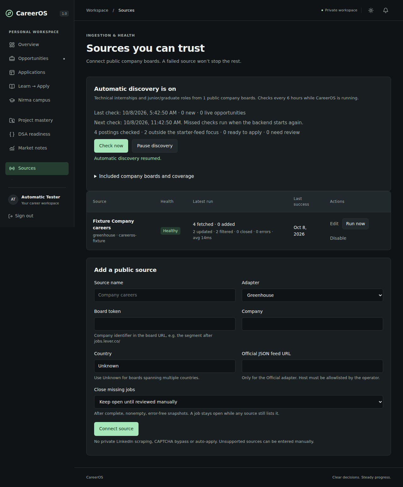

# Automatic internship discovery

CareerOS now fetches public internet job feeds automatically while its backend runs. You do not need to find board tokens or run worker commands for the included sources.

## Upgrade an existing Windows installation

1. Stop both CareerOS terminals with Ctrl+C. Back up `careeros.db` with the processes stopped.
2. Copy the updated project files into your existing `careeros` folder. Preserve `.env`, `apps/web/.env.local`, `.venv`, `careeros.db` and your own Git history. No user database or credentials are shipped in the ZIP.
3. From the project root, run:

```powershell
.\.venv\Scripts\python.exe -m alembic upgrade head
```

4. Restart the backend and frontend with your normal commands. No new Python or JavaScript dependencies are required for this update.
5. Open Overview or Sources. A first scan starts within about 30 seconds; allow a few minutes for all boards. Opportunities populate automatically. Complete My profile to improve ranking and eligibility checks.

## What happens automatically

- Six public employer boards are connected for each account, including existing accounts.
- The starter feeds retain technical internships and roles explicitly marked junior, graduate, entry-level, early-career, trainee or apprentice. Senior and unrelated HR/sales posts are filtered out.
- Jobs retain original application links and source evidence, are deduplicated, and are matched to the current profile. Unknown graduation years/academic rules remain unknown or review-required.
- Successful checks repeat every six hours. Failed/partial checks retry in one hour. Due schedules survive restarts and catch up while the backend runs again.
- In-app high-match/deadline notifications and daily/weekly summaries are generated. Summaries include a short opportunity list, match/eligibility labels, application links, recorded deadlines and learning priorities. Existing period notifications are not duplicated.
- Sources displays fetched, added, updated, filtered and closed counts. Overview displays the last check and next scheduled check. Use Check now, Pause discovery or Resume discovery as needed.
- A source disabled by you stays disabled. Existing manually configured sources are not duplicated or reconfigured; automatic relevance filters apply only to starter sources created by discovery.

## Included boards

These board APIs were checked live on 8 October 2026. Counts and openings can change.

| Employer | Public board | Feed |
|---|---|---|
| Enterpret | https://job-boards.greenhouse.io/enterpret | Greenhouse |
| CloudSEK | https://job-boards.greenhouse.io/cloudsek | Greenhouse |
| Nirmata | https://job-boards.greenhouse.io/nirmata | Greenhouse |
| Drivetrain | https://jobs.lever.co/drivetrain | Lever |
| CertifyOS | https://jobs.ashbyhq.com/certifyos | Ashby |
| Headout | https://job-boards.greenhouse.io/headoutcareers | Greenhouse |

The verification scan fetched 103 postings, filtered out 96 and imported 7 technical internships, 5 located in India and 2 in the United States. The repeat scan added zero duplicates. This is a point-in-time integration check, not a guarantee that these roles remain open or accept 2028 graduates.

## Honest coverage boundaries

This is automated fetching from the included catalog plus sources you connect, not a general web search engine. It does not scrape private LinkedIn pages, your email inbox or university portals, and does not automatically add every company on the internet. Workday and other unsupported job systems still need manual entry or a future adapter. Technical early-career filtering is title-based and can miss ambiguously named roles.

A remote role does not automatically imply India eligibility. Recognized location text provides country hints with provenance, but work authorization and graduate-batch requirements still need checking. No AI call can turn missing facts into confirmed eligibility. A high match score is not an offer probability.

The computer must be awake and online to fetch. You can close the browser; keep the backend terminal running. If the computer is off, there are no checks until it starts again. Hosting is needed for checks independent of your laptop.

Email still requires `RESEND_API_KEY`, `EMAIL_FROM` and the profile email preference. There is no built-in WhatsApp, Telegram or mobile push delivery. Market/visa notes remain sourced manual notes; they are not refreshed by this job-board feature.

## Configuration and operations

`AUTO_DISCOVERY_ENABLED=true` is the default. Set it to false to disable the API background thread. `DISCOVERY_INTERVAL_HOURS=6` controls successful scan cadence (1–168 hours). Personal pause state is controlled in Sources and stored in the database.

For a separate scheduled worker, `python -m worker discover-jobs` processes due users using the same state and locks. A one-minute or hourly scheduler can call it without forcing premature rechecks. The older `run-cycle` command remains available for explicit processing of already configured sources; it does not bootstrap catalog sources or own automatic schedule state.

The new migration head is `d82f04`. `/ready` returns 503 for older schema versions. If the checker is unavailable, inspect backend logs for `discovery_scheduler_unavailable`, confirm migrations completed and check Sources for per-board errors. One failed board does not discard successful imports from other boards.

## Browser verification screenshots

These screenshots show the deterministic test feed, not live listings:



[Mobile screenshot](screenshots/automatic-discovery-mobile.png)
